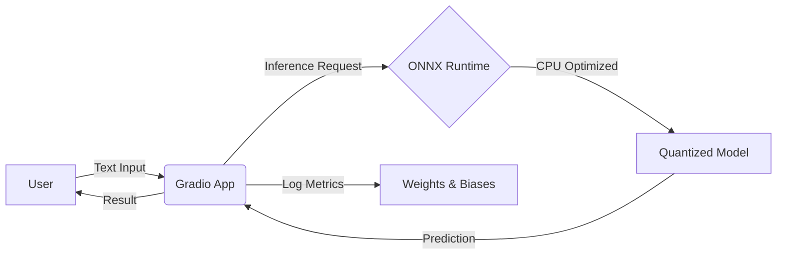

# ⚡ ONNX Optimized Financial Sentiment Service


[](https://github.com/[YOUR_GITHUB_USERNAME]/[YOUR_REPO_NAME]/actions)
[](https://huggingface.co/spaces/[YOUR_HF_USERNAME]/optimized-sentiment-service)


An end-to-end MLOps project that deploys a **Quantized (Int8) DistilBERT model** for real-time financial sentiment analysis. This project demonstrates how to optimize Transformer models for CPU inference, reducing latency and cost while maintaining accuracy.

## 🚀 Key Features

* **⚡ Model Optimization:** Converted `distilbert-base-uncased-finetuned-sst-2` to **ONNX** and applied **Dynamic Quantization (Int8)**.
    * **Size Reduction:** 255MB ➔ **64MB** (4x smaller).
    * **Inference Speed:** ~60ms ➔ **~15ms** on standard CPU.
* **🔄 CI/CD Automation:** GitHub Actions pipeline that runs unit tests and automatically syncs code to Hugging Face Spaces on merge.
* **🛠️ Engineering Rigor:**
    * **Unit Testing:** Mocked external dependencies to test logic without loading heavy models.
    * **Git LFS:** Managed large model artifacts using Git Large File Storage.
    * **Structure:** Production-ready folder structure (`src`, `tests`, etc.).

## 🏗️ Architecture



## 📂 Project Structure

```
├── .github/workflows   # CI/CD pipelines (Tests & HF Sync)
├── src/
│   ├── app.py          # Inference entry point (Gradio + WandB)
│   └── optimize_model.py # Script to convert & quantize models
├── tests/              # Unit tests (with Mocking)
├── onnx_model/         # Stores the optimized .onnx artifacts (LFS)
├── requirements.txt    # Production dependencies
└── README.md           # Documentation
```

## 🛠️ Local Installation

To run this project locally:

1. Clone the repository:

```bash
git clone https://github.com/NTRajapaksha/HuggingFace-mlops.git
cd HuggingFace-mlops
```

2. Install dependencies:

```bash
python -m venv venv
source venv/bin/activate
pip install -r requirements.txt
```

3. Run the App:

```bash
# Note: Requires 'onnx_model' folder to exist.
# If not present, run: python src/optimize_model.py
python src/app.py
```

## 🧪 Testing

This project uses `pytest` with `unittest.mock` to ensure logic correctness without requiring GPU resources or model downloads.

```bash
pytest tests/
```

## 📈 Performance

| Metric | Original Model (PyTorch) | Optimized Model (ONNX Int8) | Improvement |
|--------|--------------------------|------------------------------|-------------|
| Model Size | 255 MB | 64 MB | ~75% Reduction |
| Latency (CPU) | ~60 ms | ~17 ms | 3.5x Faster |

---

Created by Thathsara as part of an MLOps Portfolio.
